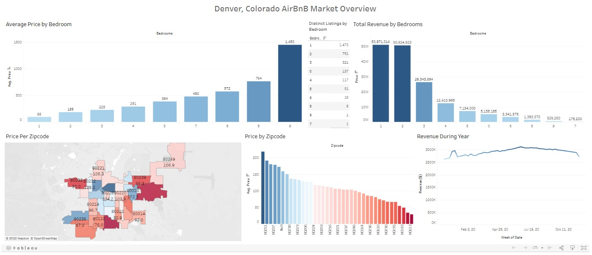

# Denver AirBnB Market Analysis in Tableau
Using AirBnB data from Denver, Colorado, I performed a curosry market analysis to understand the basics of the rental market. Inspired by friends in Salt Lake City who have successfully ventured into the AirBnB market along with a video from "Alex the Analyst" on YouTube, I downloaded data from AirBnB here: http://insideairbnb.com/get-the-data/ and created a Tabelau visualization to summarize basic market findings and to suport further exploration.

Viz Here: https://public.tableau.com/app/profile/michael.mccarthy7631/viz/DenverAirBnBGeneralAnalysisDashboard/DenverAirBnBGeneralInformation

